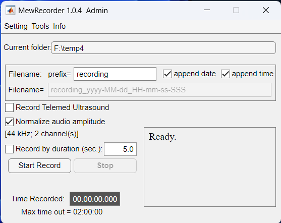

# MewRecorder
Video/Audio recorder for Telemed ultrasound machine. 

v1.2

Latest update: 02FEB2024

- "MewRecorder" is a MATLAB-based application for recording video and audio simultaneously on Telemed ultrasound machine (e.g., MicrUs Ext).
- It requires installation/running of EchoWave II software from Telemed.
- This app controls EchoWave to record ultrasound video and uses MATLAB to record audio.
- If you de-select "Record Telemed Ultrasound", then this app also serves as an audio recorder.
- The time stamps of recoding will be automatically logged.  
------------------------------------------
### INSTALLATION
##### Requirements:
Current Telemed ultrasound machine only supports Windows PC. 
A faster PC running Windows 10 or 11 is recommended. 
Minimum system RAM requirements: > 16GB (64GB is preferred.) 
Needs to dedicate at least 5GB to EchoWave. 
(EchoWave -> Menu -> Customize -> Scanning Control -> Cine -> Cine Size:  Change this value to at least 5000 MB. The more the better but do not max out.)

- MATLAB:
-   R2022b or newer
-   Audio Toolbox

##### Steps:
1. Download all the files from this distribution and put them in a folder. 
2. Install FFMPEG:
   - Download a redistributed FFMPEG release from https://ffmpeg.org and unzip it to a folder in local disk drive. 
   - Add {your local disk drive path to ffmpeg}/ffmpeg/bin/ path to OS system path
   - e.g., In Windows, Settings->System->About->Advanced system settings->Advanced->Environment Variables->System variables->Path->Edit->New-> C:\ffmpeg\bin (depending on your own path)
   
(ffmpeg release source: gyan.dev/ffmpeg/builds)
------------------------------------------
### RUN
1. Run EchoWave II in Administrator first.
2. Run MATLAB. To control EchoWave, you must run MATLAB in Administrator mode. 

- In MATLAB command window, type:
     >> cd ./MewRecorder  % [change this to your installation folder]  
     >> MewRecorder
     
### Alternative method (standalone app):
(MATLAB is not required)

You can download and install a standalone compiled app from here:

- For Windows only: [MewRecorder_installer.zip](https://yaleedu-my.sharepoint.com/:u:/g/personal/wei-rong_chen_yale_edu/EdbM5b1IBkVFvIRs2wmOmdoBl0WLy9RQf__kvFGOcbZdtA?e=5bPeY9) 

This installer will automatically download and install all required dependencies.

During installation, check "Add shortcut to desktop". 

*** Then Install FFMPEG as described above. 

After installation, right-click on the icon of MewRecorder and click "Run as administrator". 
### Recording
- The cable connected to the synchronization port on the Telemed machine must be plugged into the second channel of audio inputs (to the PC).

### Post-processing
- After recording, ultrasound video will be stored in Telemed native format .tvd file (no audio) and audio in .wav file in the current folder. 
- To combine ultrasound video and audio and convert it to MP4: Tools -> Convert all TVD to MP4
  
Before the conversion, remember to max out the screen resolution of EchoWave software and set MP4 bit rate to > 8000 Kbps.

The convsertion will take a long time. 

###
--------------------------------
### COPYRIGHT, LICENSE & DISCLAIMER
Copyright (C) 2023 Wei-Rong Chen <wei-rong.chen[AT]yale.edu>  
This program is free software under GNU General Public License, version 3.  
This program is distributed WITHOUT ANY FORM of EXPRESS or IMPLIED WARRANTY and ANY SUPPORT.    
See the GNU General Public License for more details.  

   
- The time-synchonization port should be connected to the second channel of the audio inputs. 
